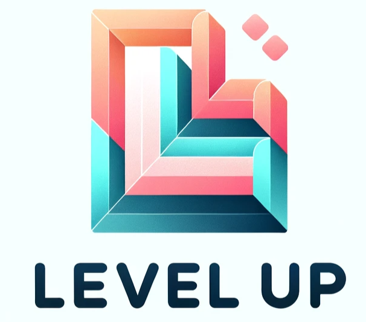
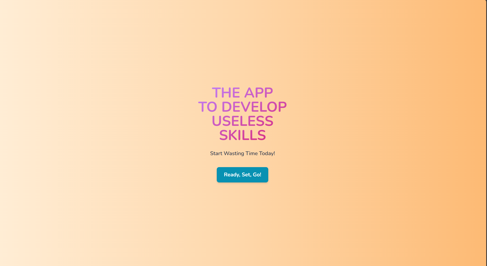
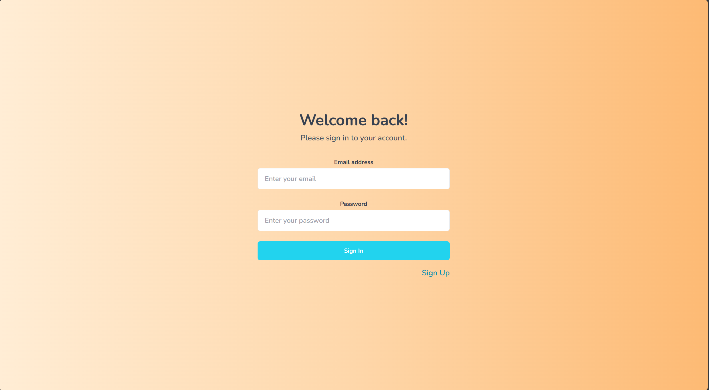
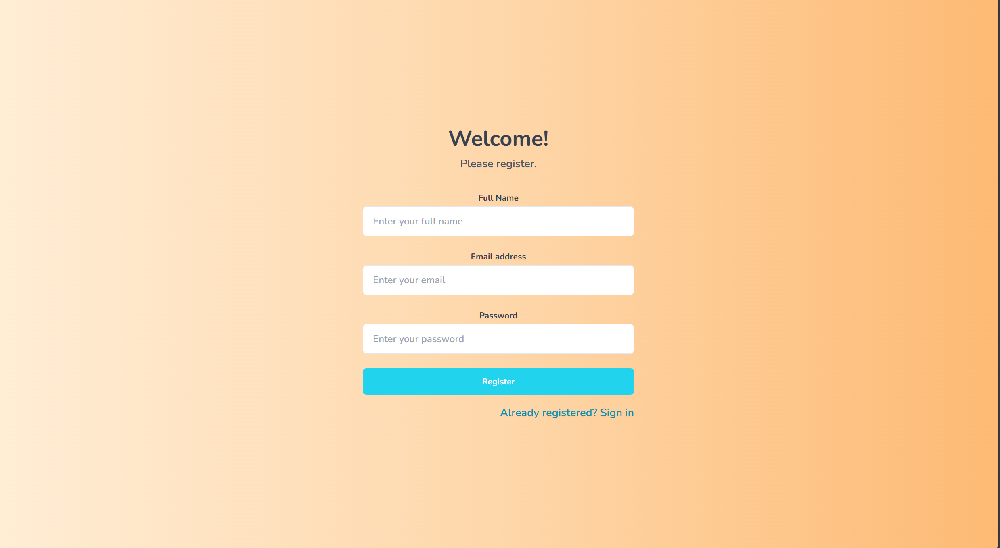
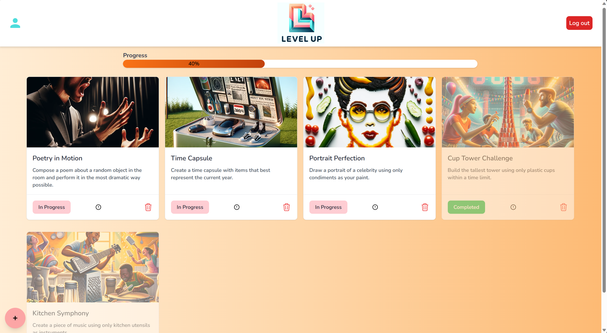
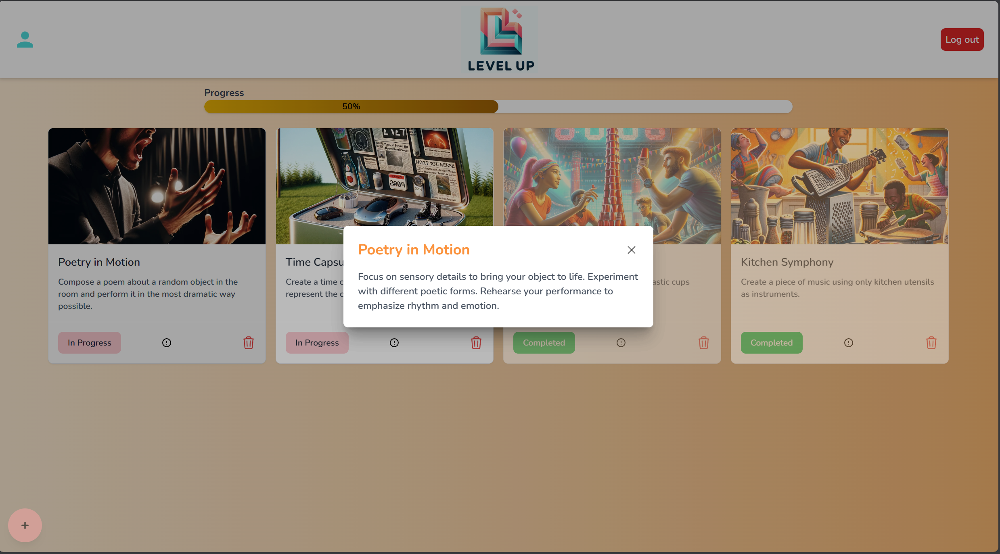
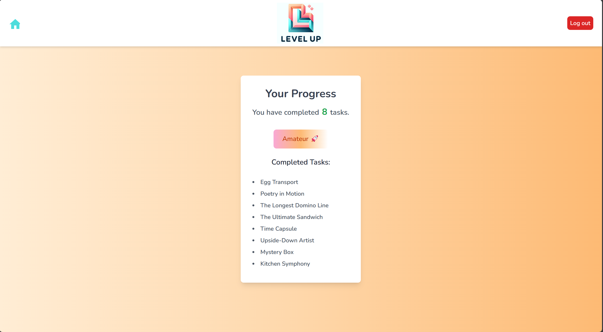
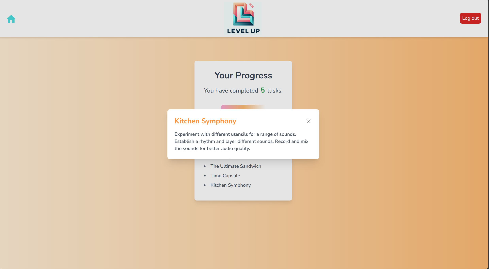
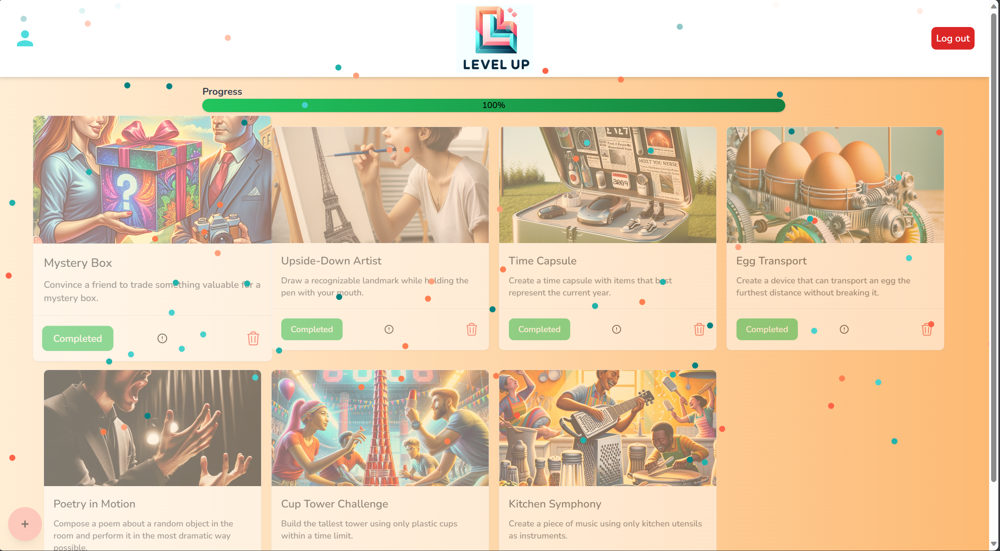

# Level Up - The App to Develop Useless Skills (PRE-REFACTOR README)

## Introduction
Welcome to "The App to Develop Useless Skills" - a unique and playful web application built with Next.js, MongoDB, Mongoose, Tailwind CSS (then converted to TypeScript and updated with NextAuth, Redux, and Jest).
This app is designed to offer users a fun way to discover and engage in various whimsical and unavailing skills.
Perfect for those moments when you want to distract yourself and learn something new yet delightfully useless.

## Features
- Interactive tasks to develop unconventional skills
- Progress tracking with a visually appealing progression bar
- Celebratory animations upon completing milestones
- Responsive design for a seamless experience across devices

## Collaborators
Founded by: Giacomo Impoco
Updated by: Christopher Heinzmann, Niels Koop

## Getting Started

### Prerequisites
- Node.js
- MongoDB

Ensure you have Node.js and MongoDB installed on your system. You can download them from:
- [Node.js](https://nodejs.org/)
- [MongoDB](https://www.mongodb.com/try/download/community)

### Installation
 **Clone the repository**
   ```bash

   git clone https: git@github.com:RaijinJS/Level-Up.git
   cd Level-Up

### Install dependencies
   npm install

### Start the development server
   npm run dev
   ```
Visit http://localhost:3000 in your browser to view the app.


## Demo Screenshots

Welcome page.



Log in page.



No account? Register here!



Click the plus in the bottom right corner to add cards to your profile. Click In Progress to toggle it to "Complete" on the card.
Remove cards by pressing the trash (bin) icon.



See more by clicking the information icon or clicking on another part of the card.



Click the profile button in the nav bar to be redirected to your progress view.



Click on the challenge names to see their info here too.



Complete all your current challenges to reach 100%.
Hurray! you've mastered all your favorite useless skills!

